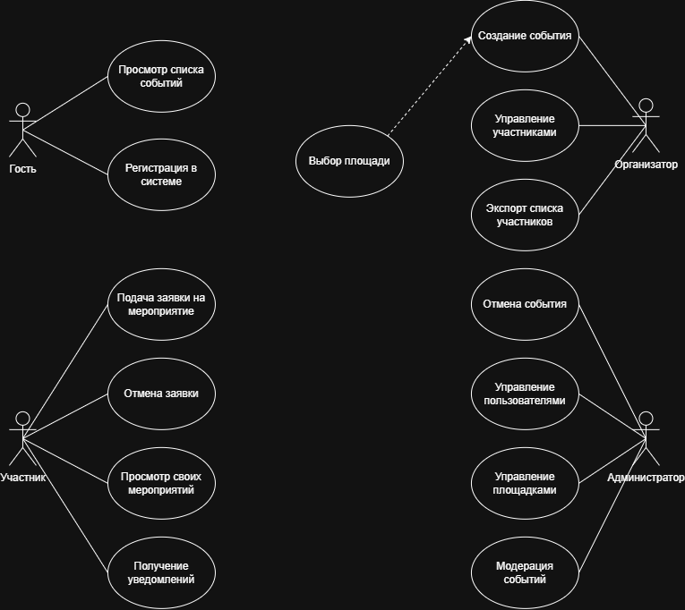

# isit-lab1
Лабораторная работа №1

## Анализ предметной области информационной системы
 
**Вариант:** 5 (Система управления мероприятиями)  
**Дисциплина:** Информационные системы и технологии  
 
---
 
## 1. Описание предметной области
Система предназначена для автоматизации процессов планирования, организации и проведения различных мероприятий (семинаров, лекций, корпоративных праздников, хакатонов) в рамках компании или образовательной организации. Предметная область охватывает управление списками участников, бронирование площадок, координацию спикеров и формирование единого расписания.
 
---
 
## 2. Проблема и цель системы
 
* **Проблема:** Регистрация участников и сбор заявок ведутся вручную через сторонние формы или таблицы, отсутствует единое наглядное расписание. Это приводит к накладкам при бронировании помещений (несколько мероприятий на одно время), задержкам в обработке списков и отсутствию своевременного информирования участников.
* **Цель:** Разработать централизованную информационную систему для автоматизации создания мероприятий, учета регистраций участников, предотвращения коллизий расписания площадок и быстрого информирования пользователей.
* **Область применения:** Отделы организации мероприятий, HR-департаменты, студотделы образовательных учреждений и администрирование площадок.
 
---
 
## 3. Анализ предметной области
 
### 3.1. Основные объекты предметной области
1. **Пользователь**
   * *Назначение:* Лицо, зарегистрированное в системе.
   * *Характеристики:* ID, ФИО, Email, Телефон, Пароль, Роль.
2. **Мероприятие**
   * *Назначение:* Событие, планируемое к проведению.
   * *Характеристики:* ID, Название, Описание, Дата и время начала, Дата и время окончания, Лимит участников, Формат (онлайн/офлайн).
3. **Площадка**
   * *Назначение:* Помещение или виртуальное пространство для проведения события.
   * *Характеристики:* ID, Название, Адрес/Номер аудитории, Вместимость, Наличие оборудования.
4. **Заявка на участие**
   * *Назначение:* Фиксация записи пользователя на конкретное мероприятие.
   * *Характеристики:* ID, Дата подачи, Статус (Подтверждена, В ожидании, Отменена).
5. **Спикер**
   * *Назначение:* Докладчик или ведущий события.
   * *Характеристики:* ID, ФИО, Специализация, Контактные данные.
6. **Организатор**
   * *Назначение:* Ответственное лицо за подготовку мероприятия.
   * *Характеристики:* ID, Отдел, Должность, Рабочий телефон.
 
### 3.2. Связи между объектами
* **Организатор** *создает* **Мероприятие** (1:N — один организатор может создать много мероприятий).
* **Мероприятие** *проводится на* **Площадке** (N:1 — на одной площадке в разное время проводится много мероприятий).
* **Пользователь** *оформляет* **Заявку на участие** (1:N — один пользователь может подать много заявок).
* **Заявка на участие** *регистрируется на* **Мероприятие** (N:1 — к одному мероприятию относится множество заявок).
* **Спикер** *закрепляется за* **Мероприятием** (M:N — спикер может вести несколько мероприятий, и у события может быть несколько спикеров).
 
---
 
## 4. Пользователи и роли
 
| Роль | Назначение | Основные действия |
| :--- | :--- | :--- |
| **Гость** | Неавторизованный посетитель | Просмотр общедоступного каталога мероприятий, прохождение регистрации аккаунта. |
| **Участник** | Пользователь, посещающий события | Подача заявки на мероприятие, отмена записи, просмотр истории своих посещений, просмотр персонального календаря. |
| **Организатор** | Ответственный за проведение событий | Создание и редактирование мероприятий, выбор площадок, просмотр и экспорт списков участников, отмена мероприятий. |
| **Администратор** | Системный управляющий | Управление пользователями и правами доступа, добавление и редактирование площадок, модерация мероприятий, просмотр системных логов. |
 
---
 
## 5. Функциональные требования
 
* **FR-01.** Система должна предоставлять пользователю возможность зарегистрироваться и пройти аутентификацию.
* **FR-02.** Система должна позволять пользователю просматривать список доступных мероприятий с возможностью фильтрации по дате и категории.
* **FR-03.** Система должна позволять участнику подавать заявку на участие в выбранном мероприятии.
* **FR-04.** Система должна позволять участнику отменять свою заявку на мероприятие в личном кабинете.
* **FR-05.** Система должна позволять организатору создавать новое мероприятие с указанием темы, даты, лимита участников и площадки.
* **FR-06.** Система должна автоматически блокировать возможность подачи заявок на мероприятие при достижении лимита участников.
* **FR-07.** Система должна проверять доступность площадки на выбранное время и блокировать создание мероприятий на одно и то же время в одном помещении (предотвращение коллизий).
* **FR-08.** Система должна позволять организатору просматривать и экспортировать список зарегистрированных участников.
* **FR-09.** Система должна отправлять участнику E-mail уведомление с подтверждением регистрации и напоминанием перед началом события.
* **FR-10.** Система должна позволять администратору ведать справочник площадок (добавлять, редактировать, удалять параметры аудиторий).
* **FR-11.** Система должна позволять администратору изменять роли пользователей.
* **FR-12.** Система должна предоставлять организатору возможность отменять мероприятие с автоматическим уведомлением зарегистрированных участников.
 
---
 
## 6. Концепция информационной системы
 
* **Назначение:** Создание единой платформы для полной автоматизации цикла организации мероприятий, оптимизации загрузки аудиторного фонда и управления списком участников.
* **Основные возможности:**
  * Публичный каталог событий с поиском и фильтрацией.
  * Интерактивная система бронирования площадок без временных накладок.
  * Автоматический контроль свободных мест на мероприятии.
  * Панель организатора для выгрузки аналитики и списков участников.
* **Тип системы:** Веб-приложение (Web-application) с адаптивным интерфейсом для ПК и мобильных устройств.
* **Основные компоненты:**
  * **Пользователь / Клиент:** Веб-браузер на устройстве пользователя.
  * **Web-интерфейс (Frontend):** Пользовательская часть для взаимодействия с системой.
  * **Серверная часть (Backend):** Сервис обработки бизнес-логики, проверки коллизий расписания и отправки уведомлений.
  * **База данных (Database):** Хранилище сущностей, пользователей, расписания и заявок.
* **Результат использования:** Сокращение времени на подготовку мероприятий, исключение накладок в бронировании помещений и повышение посещаемости событий за счет автоматических напоминаний.
 
---
 
## 7. Схемы
 
Диаграмма прецедентов использования (Use-Case Diagram) отражает основные категории пользователей и выполняемые ими действия:
 

 

 
---
 
## 8. Вывод
В ходе лабораторной работы №1 был проведен полный анализ предметной области системы управления мероприятиями. Сформулированы ключевые проблемы существующего процесса, определены цели создания ИС и область её применения. Выделены 6 основных объектов, описаны 4 категории ролей, а также сформировано 12 функциональных требований. Разработанная Use-Case диаграмма и концепция ИС послужат базой для дальнейшего проектирования структуры базы данных и архитектуры приложения.
