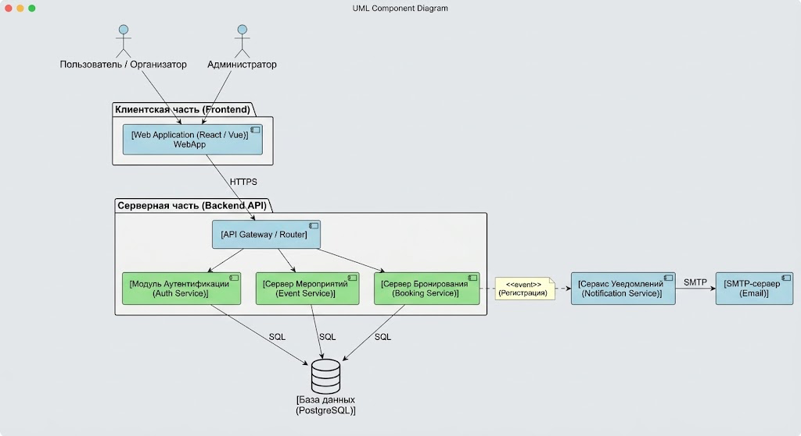

# Лабораторная работа №2
## Проектирование информационной системы
 
**Тема:** Проектирование архитектуры системы управления мероприятиями (Event Management System — EMS)  
**Вариант:** 5  
**Дисциплина:** Информационные системы и технологии  
 
---
 
## 1. Описание предметной области
 
Система управления мероприятиями предназначена для автоматизации процессов планирования, организации, учета и проведения корпоративных и образовательных событий (семинаров, мастер-классов, конференций, спортивных и культурных мероприятий).
 
**Существующая проблема:**  
В организациях регистрация участников часто происходит через разрозненные каналы (мессенджеры, бумажные списки, гугл-формы), отсутствует единый реестр площадок/аудиторий и автоматизированный контроль заполнености залов. Это приводит к коллизиям в расписании (пересечению событий на одной площадке), высокой трудоемкости работы организаторов при формировании списков и отсутствию единого источника информации для участников.
 
**Решение:**  
Разработка централизованной веб-системы, объединяющей функции публикации событий, онлайн-регистрации участников, бронирования помещений с контролем пересечений по времени и автоматической рассылкой уведомлений.
 
---
 
## 2. Пользователи и роли
 
| Роль | Назначение | Основные функции | Уровень доступа |
| :--- | :--- | :--- | :--- |
| **Гость** | Неавторизованный посетитель системы | Просмотр общедоступного каталога событий, просмотр детальной информации о мероприятии, регистрация нового аккаунта. | Публичный (только чтение общедоступных данных). |
| **Участник** | Авторизованный пользователь (сотрудник/студент) | Подача и отмена заявок на участие в событиях, просмотр истории посещений и личного календаря зарегистрированных мероприятий, получение E-mail уведомлений. | Ограниченный пользовательский доступ (управление личным профилем и своими заявками). |
| **Организатор** | Ответственный за проведение мероприятий | Создание и редактирование событий, бронирование площадок, просмотр и управление списком участников, экспорт списков, отмена событий с отправкой уведомлений. | Расширенный (управление своими мероприятиями и привязаными ресурсами). |
| **Администратор** | Системный администратор | Ведение справочника площадок и аудиторий, управление учетными записями и ролями пользователей, модерация публикаций, просмотр системных логов. | Полный (административный доступ ко всем сущностям и настройкам). |
 
---
 
## 3. Сценарии использования
 
### Сценарий 1. Регистрация участника на мероприятие
* **Инициатор:** Участник (авторизованный пользователь).
* **Пошаговое описание:**
  1. Пользователь выполняет вход в систему под своей учетной записью.
  2. Пользователь открывает каталог доступных мероприятий.
  3. Пользователь применяет фильтры (по дате/категории) и выбирает интересующее событие.
  4. Система отображает детальную страницу мероприятия, расписание и количество свободных мест.
  5. Пользователь нажимает кнопку «Зарегистрироваться».
  6. Система проверяет наличие свободных мест и отсутствие повторной записи.
  7. Система уменьшает количество свободных мест и создает запись в БД со статусом «Подтверждено».
  8. Система отправляет на Email пользователя письмо с подтверждением и добавляет событие в личный календарь.
* **Ожидаемый результат:** Пользователь успешно зарегистрирован на событие, свободные места обновились, подтверждение отправлено на почту.
 
### Сценарий 2. Создание нового мероприятия и бронирование площадки
* **Инициатор:** Организатор.
* **Пошаговое описание:**
  1. Организатор переходит в личный кабинет и нажимает «Создать мероприятие».
  2. Организатор заполняет форму: название, описание, дата и время начала/окончания, лимит участников.
  3. Организатор выбирает площадку из доступного справочника аудиторий.
  4. Система выполняет автоматическую проверку на отсутствие временных коллизий (не забронирована ли площадка на это же время другим событием).
  5. Организатор при необходимости прикрепляет программу мероприятия и спикеров.
  6. Организатор нажимает «Опубликовать».
  7. Система сохраняет мероприятие и публикует его в общем каталоге.
* **Ожидаемый результат:** Мероприятие создано, площадка забронирована на выбранный интервал времени без коллизий.
 
### Сценарий 3. Отмена заявки на участие
* **Инициатор:** Участник.
* **Пошаговое описание:**
  1. Участник заходит в личный кабинет в раздел «Мои мероприятия».
  2. Пользователь выбирает событие, которое больше не планирует посещать.
  3. Пользователь нажимает кнопку «Отменить запись».
  4. Система запрашивает подтверждение действия.
  5. Пользователь подтверждает отмену.
  6. Система меняет статус заявки на «Отменена» и увеличивает счетчик доступных мест на 1.
  7. Система удаляет событие из личного календаря пользователя.
* **Ожидаемый результат:** Заявка аннулирована, свободное место возвращено в общий доступ.
 
### Сценарий 4. Экспорт списка участников организатором
* **Инициатор:** Организатор.
* **Пошаговое описание:**
  1. Организатор открывает список созданных им мероприятий.
  2. Выбирает конкретное событие и переходит во вкладку «Участники».
  3. Система отображает таблицу всех зарегистрированных пользователей с их статусами.
  4. Организатор выбирает опцию «Экспортировать список» и указывает формат (CSV/Excel).
  5. Система формирует файл с персональными данными зарегистрированных участников (ФИО, Email, кафедра/отдел).
  6. Файл автоматически скачивается на устройство организатора.
* **Ожидаемый результат:** Организатор получил актуальный файл со списком участников для пропускного пункта или регистрации на входе.
 
### Сценарий 5. Добавление новой площадки администратором
* **Инициатор:** Администратор.
* **Пошаговое описание:**
  1. Администратор заходит в раздел «Управление ресурсами» -> «Площадки».
  2. Нажимает кнопку «Добавить площадку».
  3. Заполняет поля: название аудитории/зала, адрес, вместимость, наличие оборудования (проект, микрофоны и т.д.).
  4. Нажимает «Сохранить».
  5. Система валидирует данные и заносит запись в справочник площадок.
* **Ожидаемый результат:** Новая площадка становится доступна для выбора организаторами при планировании мероприятий.
 
---
 
## 4. Диаграмма сценариев использования (Use Case)
 
На диаграмме сценариев использования показано взаимодействие различных категорий пользователей (Актёров) с основными функциями системы (Прецедентами):
 

 
*Исходный файл диаграммы:* [diagrams/subject-area.drawio](diagrams/subject-area.drawio)*
 
**Описание диаграммы:**
* **Актёры:** `Гость`, `Участник` (наследует права гостя), `Организатор`, `Администратор`.
* **Граница системы (EMS):** Объединяет ключевые прецеденты.
* **Связь `<<include>>`:** Прецедент «Создание мероприятия» обязательно включает в себя прецедент «Бронирование площадки», так как событие не может существовть без указания места или ссылки на онлайн-комнату.
 
---
 
## 5. Компоненты системы
 
| Компонент | Назначение | Взаимодействует с компонентами |
| :--- | :--- | :--- |
| **Web Application (Frontend)** | Клиентский веб-интерфейс (SPA) для отображения страниц, каталога, личного кабинета и форм ввода. | API Gateway (HTTP/REST API). |
| **API Gateway / Router** | Единая точка входа для всех клиентских запросов. Маршрутизирует запросы и проверяет маркеры авторизации. | Web Application, Auth Service, Event Service, Booking Service. |
| **Auth Service (Сервис аутентификации)** | Отвечает за регистрацию, авторизацию пользователей, генерацию JWT-токенов и разграничение прав доступа. | API Gateway, База данных. |
| **Event Service (Сервис мероприятий)** | Управляет созданием, редактированием, фильтрацией и просмотром каталога мероприятий. | API Gateway, База данных. |
| **Booking Service (Сервис бронирования)** | Обрабатывает заявки пользователей на участие, контролирует лимиты мест и проверяет пересечения по времени для площадок. | API Gateway, База данных, Notification Service. |
| **Notification Service (Сервис уведомлений)** | Отвечает за фоновую генерацию и отправку электронных писем с подтверждениями и напоминаниями. | Booking Service, Email-сервер. |
| **Database (База данных PostgreSQL)** | Централизованное реляционное хранилище пользователей, мероприятий, площадок и регистраций. | Auth Service, Event Service, Booking Service. |
| **External Email Server (SMTP)** | Внешний или локальный почтовый сервис для физической доставки e-mail сообщений адресатам. | Notification Service. |
 
---
 
## 6. Диаграмма компонентов
 
Диаграмма компонентов отражает верхнеуровневую архитектуру информационной системы и способы взаимодействия между ее модулями:
 

 
*Исходный файл диаграммы:* [diagrams/architecture.puml](diagrams/architecture.puml)*
 
**Описание архитектуры:**
Пользователи взаимодействуют с системой через веб-браузер (**Web Application**). Клиент отправляет запросы по протоколу HTTPS на **API Gateway**, который перенаправляет их соответствующим микросервисам или модулям бэкенда (**Auth Service**, **Event Service**, **Booking Service**). Модули обращаются к единой реляционной **Базе данных** посредством SQL-запросов. При создании заявки **Booking Service** генерирует событие для **Notification Service**, который по протоколу SMTP отправляет письма через **Email-сервер**.
 
---
 
## 7. Концепция информационной системы
 
* **Назначение и цель:** Создание единого цифрового пространства для автоматизации планирования и учета мероприятий, управления загрузкой аудиторий и регистрации участников.
* **Основные возможности:**
  * Каталог мероприятий с поиском, категориями и фильтрацией.
  * Личный кабинет участника с персональным расписанием.
  * Панель организатора с функцией предотвращения коллизий бронирования площадок.
  * Автоматический контроль лимита свободных мест.
  * Экспорт списков участников для контроля посещаемости.
  * Email-уведомления и напоминания о предстоящих событиях.
* **Тип системы:** Клиент-серверное веб-приложение (Single Page Application + REST API Backend).
* **Компонентный стек:** Frontend (React/Vue), Backend (Node.js/Python/Java/Go), СУБД (PostgreSQL), Почтовый сервис (SMTP).
