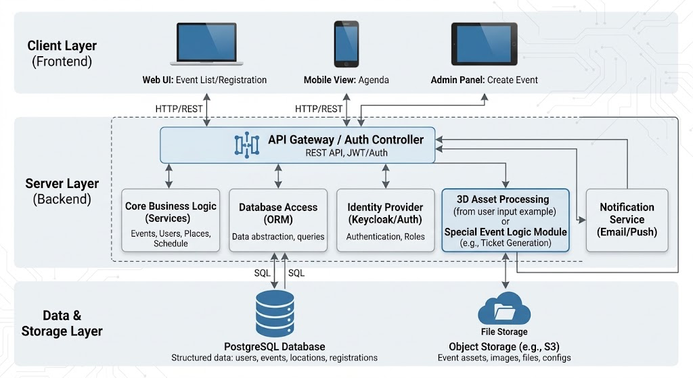
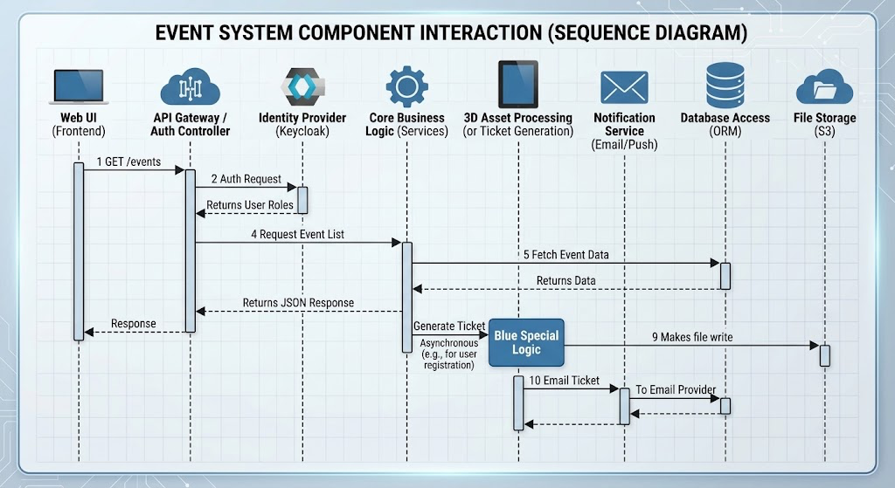

# Лабораторная работа №3
## Проектирование архитектуры информационной системы
 
### Цель работы
 
Изучить принципы проектирования архитектуры информационных систем, определить структуру приложения, спроектировать взаимодействие между основными компонентами и подготовить структуру программного проекта для дальнейшей разработки.
 
---
 
## Краткое описание выполненного задания
 
На основе предметной области «Система управления мероприятиями» спроектирована архитектура информационной системы: выбран архитектурный стиль, определены компоненты и их ответственность, описано взаимодействие компонентов на примере сценария регистрации на мероприятие, разработана структура каталогов проекта, а также выделена и отражена в архитектуре индивидуальная нетиповая особенность предметной области — генерация электронных билетов с QR-кодами и транзакционный контроль вместимости площадок.
 
---
 
## Основные результаты работы
 
### 1. Архитектурный стиль
 
Трехуровневая архитектура веб-приложения (3-tier).
 
* **Frontend (клиентская часть)** - интерфейс пользователя и организатора.
* **Backend (серверная часть)** - обработка бизнес-логики и маршрутизация запросов.
* **Database (база данных)** - надежное хранение данных системы.
 
### 2. Компоненты системы
 
| Компонент | Назначение и ответственность |
| :--- | :--- |
| **Веб-интерфейс (Frontend)** | Отображение афиши мероприятий, форм создания событий, регистрация пользователей, личный кабинет. Отправка запросов к API. |
| **API (API Gateway)** | Прием HTTP-запросов от веб-интерфейса, маршрутизация. |
| **Контроллеры** | Разбор входящих запросов, валидация DTO, вызов нужных сервисов, формирование HTTP-ответов. |
| **Бизнес-логика (Сервисы)** | Реализация бизнес-правил: логика регистрации, проверка расписания, управление списками участников. |
| **Репозитории** | Абстракция для доступа к данным, чтение и запись сущностей в БД. |
| **Модуль аутентификации** | Проверка личности пользователя (JWT) и разделение прав доступа (Организатор / Участник). |
| **Генератор билетов (Ticket Engine)** | **[Индивидуальная особенность]** Асинхронное формирование PDF-билетов с уникальным QR-кодом для участников. |
| **БД (PostgreSQL)** | Хранение пользователей, профилей мероприятий, расписаний, площадок и истории регистраций. |
 
### 3. Взаимодействие компонентов
 
Общая последовательность обработки запроса пользователя (Сценарий: Регистрация на мероприятие):
 
1. Пользователь выбирает мероприятие и нажимает «Зарегистрироваться» в веб-интерфейсе.
2. Frontend отправляет HTTP POST запрос на backend к API.
3. API проверяет права доступа (авторизацию) через Модуль аутентификации.
4. Контроллер принимает запрос и вызывает сервис бизнес-логики (EventRegistrationService).
5. Сервис обращается к репозиторию для проверки наличия свободных мест на площадке.
6. Если места есть, сервис генерирует запись о регистрации, а репозиторий выполняет SQL-запрос на сохранение в БД.
7. Сервис асинхронно вызывает Модуль генерации билетов (Ticket Engine) для создания PDF с QR-кодом и отправки его на email пользователя.
8. Результат действия (успешная регистрация) возвращается через API обратно на frontend и отображается пользователю.
 
### 4. Структура проекта

```
project/
├── frontend/                 # клиентская часть (UI для участников и организаторов)
├── backend/                  # серверная часть
│   ├── controllers/          # обработка HTTP запросов (API эндпоинты)
│   ├── services/             # бизнес-логика (управление мероприятиями)
│   ├── repositories/         # доступ к данным (SQL запросы / ORM)
│   ├── models/               # модели данных и DTO (Event, User, Ticket)
│   ├── routes/               # API маршруты
│   └── ticket_engine/        # модуль генерации QR-билетов (индивидуальная особенность)
├── database/                 # SQL-скрипты, миграции и схема БД
├── docs/                     # документация (схемы, OpenAPI/Swagger)
└── README.md                 # результаты работы по лабораторной
```

### 5. Индивидуальная особенность предметной области

В системе была выделена нетиповая особенность — Генерация персональных билетов с QR-кодом и строгий контроль вместимости. Процесс записи на мероприятие не является простым CRUD-действием. Система должна транзакционно убедиться, что лимит участников для конкретного помещения не превышен, а затем асинхронно сгенерировать уникальный артефакт (PDF-билет с QR-кодом) и отправить его пользователю. Это событие обрабатывается отдельно от основного потока, чтобы не блокировать быстрый ответ API веб-интерфейсу.

---

## Диаграммы и схемы

### Диаграмма архитектуры системы



|**Исходник:** 

### Диаграмма взаимодействия компонетов



|**Исходник:** 

## Вывод

В результате работы спроектирована архитектура информационной системы «Система управления мероприятиями» на основе трёхуровневого подхода (Frontend / Backend / Database). Определены зоны ответственности каждого компонента, описано взаимодействие между ними на конкретном сценарии (регистрация пользователя), выделена индивидуальная особенность предметной области (транзакционный контроль мест и асинхронная генерация билетов) и отвечающий за неё компонент, подготовлена структура каталогов будущего проекта. Полученные результаты формируют основу для реализации системы в последующих лабораторных работах.
