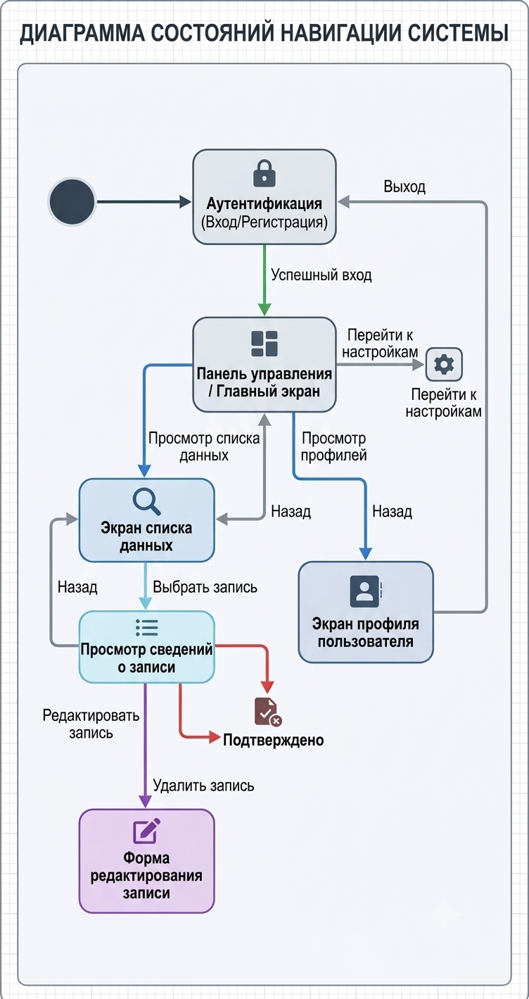

# Лабораторная работа №4
## Проектирование пользовательского интерфейса информационной системы

**Предметная область:** Система управления мероприятиями  
**Модуль:** Архитектура современных информационных систем  
**Тема:** Архитектура веб-систем: клиент, сервер и API  

---

### Цель работы

Изучить основные принципы проектирования пользовательских интерфейсов (UX/UI), разработать структуру экранов информационной системы управления мероприятиями, спроектировать схему навигации и подготовить wireframe-прототипы основных страниц с описанием их элементов и связей с API.

---

## 1. Структура пользовательского интерфейса (Перечень экранов)

В системе определены 5 основных экранов, обеспечивающих полный жизненный цикл работы организаторов и участников мероприятий:

| № | Название экрана | Назначение экрана | Основные элементы интерфейса | Доступные действия |
|---|---|---|---|---|
| **1** | **Авторизация и Регистрация** (`/login`) | Идентификация пользователя и разделение ролей (Участник / Организатор). | Форма ввода (Email, пароль), переключатель «Вход / Регистрация», выбор роли при регистрации, кнопка «Войти». | Вход в систему, переход к форме регистрации, восстановление пароля. |
| **2** | **Дашборд / Главная страница** (`/dashboard`) | Центральный хаб с анонсами, ближайшими событиями и статистикой. | Шапка с профилем, боковое меню, баннер топового события, календарь ближайших мероприятий, фильтры. | Переход в каталог событий, быстрый переход к купленным билетам/созданным мероприятиям. |
| **3** | **Каталог мероприятий** (`/events`) | Просмотр списка всех доступных мероприятий с возможностью поиска. | Поисковая строка, фильтры (категория, дата, площадка), сетка карточек мероприятий с индикаторами свободных мест. | Поиск, фильтрация, сортировка, переход к карточке конкретного мероприятия. |
| **4** | **Детальная страница мероприятия** (`/events/{id}`) | Отображение полной информации о событии и запись на него. | Описание, спикеры, карта/площадка, счетчик оставшихся мест, кнопка «Зарегистрироваться / Забронировать». | Регистрация на мероприятие, скачивание билета, добавление в личный календарь. |
| **5** | **Создание и редактирование мероприятия** (`/events/create`) | **[Экран Организатора]** Формирование нового события. | Поля ввода (название, дата, время, вместимость площадки), загрузка афиши, выбор помещения, кнопка «Опубликовать». | Заполнение параметров события, проверка доступности площадки, сохранение черновика / публикация. |

---

## 2. Проектирование навигации

Навигация построена по гибридной схеме: древовидная структура с центральным экраном (Дашборд) и быстрым боковым меню (Sidebar), адаптированным под роль пользователя.

### Схема навигации между экранами (Mermaid)

```mermaid
graph TD
    Login["1. Экран авторизации (/login)"] -->|Успешный вход| Dashboard["2. Главная страница / Дашборд (/dashboard)"]
    
    Dashboard -->|Клик 'Все события'| EventsList["3. Каталог мероприятий (/events)"]
    Dashboard -->|Клик 'Создать' (Только Организатор)| EventCreate["5. Создание мероприятия (/events/create)"]
    
    EventsList -->|Выбор карточки| EventDetail["4. Карточка мероприятия (/events/{id})"]
    
    EventDetail -->|Успешная регистрация| TicketModal["Модальное окно: Билет с QR-кодом"]
    
    EventCreate -->|Клик 'Опубликовать'| EventDetail
    
    TicketModal -->|Клик 'В мои билеты'| Dashboard
    
    EventsList -->|Клик на лого/главная| Dashboard
    EventDetail -->|Назад в каталог| EventsList
```


|**Исходник:** 

---

## 3. Прототипы и макеты страниц (Wireframes)

### 3.1. Экран 1: Авторизация и Вход (`/login`)

```text
+-----------------------------------------------------------------------+
|                        СИСТЕМА УПРАВЛЕНИЯ МЕРОПРИЯТИЯМИ               |
+-----------------------------------------------------------------------+
|                                                                       |
|                       +-----------------------+                       |
|                       |     Вход в систему    |                       |
|                       +-----------------------+                       |
|                       | Email:                |                       |
|                       | [ user@company.com  ] |                       |
|                       |                       |                       |
|                       | Пароль:               |                       |
|                       | [ ****************  ] |                       |
|                       |                       |                       |
|                       | Роль:                 |                       |
|                       | (o) Участник  ( ) Организатор                 |
|                       |                       |                       |
|                       | [    ВОЙТИ В СИСТЕМУ  ] |                       |
|                       |                       |                       |
|                       | Нет аккаунта? Зарегистрироваться              |
|                       +-----------------------+                       |
|                                                                       |
+-----------------------------------------------------------------------+
```

---

### 3.2. Экран 2: Главная страница / Дашборд (`/dashboard`)

```text
+-----------------------------------------------------------------------+
| [LOGO] EventManager   [Поиск...]     (i) Уведомления | [Профиль (Иван)]|
+---------------+-------------------------------------------------------+
| NAVIGATION    | ДОБРО ПОЖАЛОВАТЬ, ИВАН!                               |
| ------------- | +---------------------------------------------------+ |
| [x] Главная   | | БЛИЖАЙШЕЕ СОБЫТИЕ: IT-Конференция 2026             | |
| [ ] События   | | Дата: 15 Октября | Место: Зал "Альфа" (24 места)   | |
| [ ] Мои билеты| | [ ПОДРОБНЕЕ И РЕГИСТРАЦИЯ ]                       | |
| [ ] Создать   | +---------------------------------------------------+ |
|     (Орг)     |                                                       |
|               | РЕКОМЕНДУЕМЫЕ МЕРОПРИЯТИЯ                             |
|               | +-------------------+  +-------------------+          |
|               | | Митап по Python   |  | Хакатон Design    |          |
|               | | 12 Окт | 10 мест  |  | 20 Окт | 5 мест   |          |
|               | | [ Посмотреть ]    |  | [ Посмотреть ]    |          |
|               | +-------------------+  +-------------------+          |
+---------------+-------------------------------------------------------+
```

---

### 3.3. Экран 3: Каталог мероприятий (`/events`)

```text
+-----------------------------------------------------------------------+
| [LOGO] EventManager   [Поиск мероприятия...]         | [Профиль (Иван)]|
+---------------+-------------------------------------------------------+
| ФИЛЬТРЫ       | КАТАЛОГ МЕРОПРИЯТИЙ                                   |
| ------------- | ----------------------------------------------------- |
| Категория:    | [ Сортировка: По дате v ]                             |
| [Все       v] |                                                       |
|               | +---------------------------------------------------+ |
| Площадка:     | | IT-Конференция 2026                 [ Доступно: 24]| |
| [Зал "Альфа"] | | Дата: 15.10.2026 | Спикер: Алексей Смирнов        | |
|               | | [ Подробнее ]                                     | |
| Дата:         | +---------------------------------------------------+ |
| [ 10.10.2026] | | Воркшоп по UX/UI                    [ МЕСТ НЕТ   ]| |
|               | | Дата: 18.10.2026 | Спикер: Анна Петрова           | |
| [Сбросить]    | | [ Мероприятие завершено ]                         | |
|               | +---------------------------------------------------+ |
+---------------+-------------------------------------------------------+
```

---

### 3.4. Экран 4: Детальная страница мероприятия (`/events/{id}`)

```text
+-----------------------------------------------------------------------+
| [LOGO] EventManager  < Назад в каталог               | [Профиль (Иван)]|
+-----------------------------------------------------------------------+
|                                                                       |
|  IT-Конференция 2026                                                  |
|  Категория: IT & Технологии | Организатор: Отдел Разработки           |
|  -------------------------------------------------------------------  |
|  ОПИСАНИЕ:                                                            |
|  Ежегодная конференция, посвященная веб-разработке и архитектуре.     |
|                                                                       |
|  ДЕТАЛИ ПРОВЕДЕНИЯ:                                                   |
|  * Дата и время: 15 Октября 2026, 10:00 - 18:00                       |
|  * Место проведения: Зал "Альфа", Главный корпус (Этаж 3)            |
|  * Оставшиеся места: 24 из 100                                        |
|                                                                       |
|  +-----------------------------------------------------------------+  |
|  | [   ЗАРЕГИСТРИРОВАТЬСЯ И ПОЛУЧИТЬ БИЛЕТ (С QR-КОДОМ)   ]        |  |
|  +-----------------------------------------------------------------+  |
|                                                                       |
+-----------------------------------------------------------------------+
```

---

### 3.5. Экран 5: Создание мероприятия (`/events/create`)

```text
+-----------------------------------------------------------------------+
| [LOGO] EventManager  < Назад в дашборд               | [Организатор]  |
+-----------------------------------------------------------------------+
|                                                                       |
|  СОЗДАНИЕ НОВОГО МЕРОПРИЯТИЯ                                         |
|  -------------------------------------------------------------------  |
|  Название мероприятия:                                                |
|  [ Введите название...                                              ] |
|                                                                       |
|  Дата и время начала:                  Вместимость (Макс. мест):     |
|  [ 2026-10-15T10:00     ]              [ 100                        ] |
|                                                                       |
|  Выбор площадки:                                                      |
|  [ Зал "Альфа" (Вместимость: 100 чел.)                            v ] |
|                                                                       |
|  Описание события:                                                    |
|  +-----------------------------------------------------------------+  |
|  | Введите подробное описание мероприятия...                       |  |
|  +-----------------------------------------------------------------+  |
|                                                                       |
|  [ СОХРАНИТЬ ЧЕРНОВИК ]             [ ОПУБЛИКОВАТЬ МЕРОПРИЯТИЕ ]     |
|                                                                       |
+-----------------------------------------------------------------------+
```

---

## 4. Домашняя доработка: Описание интеграции с API

Каждый элемент пользовательского интерфейса связан с соответствующим HTTP API эндпоинтом backend-сервера:

| Экран | Элемент UI | Событие / Действие | API Endpoint & Метод |
|---|---|---|---|
| **Форма входа** | Кнопка «Войти» | Нажатие | `POST /api/v1/auth/login` |
| **Каталог** | Таблица / Сетка карточек | Загрузка страницы | `GET /api/v1/events?page=1&limit=10` |
| **Каталог** | Фильтр по дате/площадке | Изменение значения | `GET /api/v1/events?locationId={id}&date={date}` |
| **Детализация** | Кнопка «Зарегистрироваться» | Нажатие | `POST /api/v1/events/{id}/register` |
| **Создание** | Кнопка «Опубликовать» | Нажатие | `POST /api/v1/events` |
| **Создание** | Выпадающий список площадок | Открытие формы | `GET /api/v1/locations` |

---

## 5. Принятые UX/UI решения

1. **Минимизация кликов (UX):** Зарегистрироваться на событие пользователь может всего в 2 клика с Главной страницы или из Каталога.
2. **Обратная связь (UI):** Карточки с отсутствием свободных мест автоматически блокируют кнопку регистрации и меняют цвет статуса на «МЕСТ НЕТ».
3. **Разделение ролей:** Меню и кнопка «Создать мероприятие» отображаются исключительно пользователям с ролью `Organizer`.
4. **Адаптивность:** Сетка карточек и формы оптимизированы под перестроение в одну колонку на мобильных устройствах.

---

